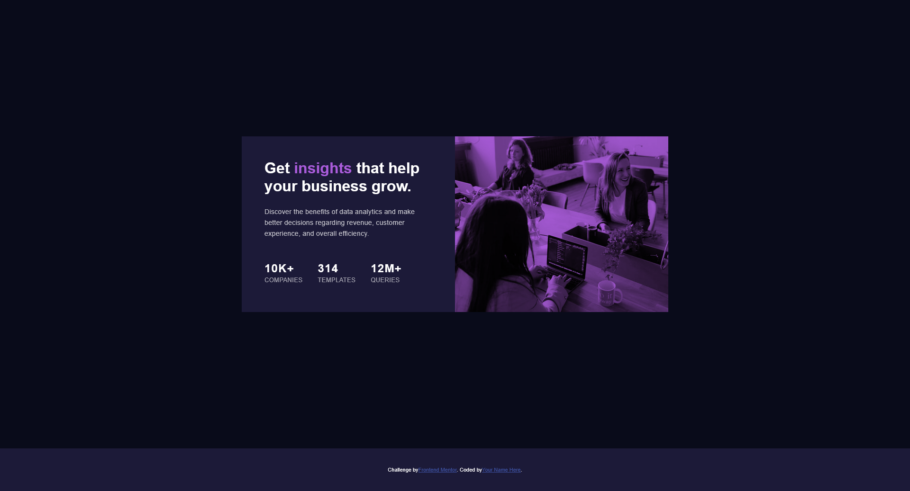

# Frontend Mentor - Stats preview card component solution

This is a solution to the [Stats preview card component challenge on Frontend Mentor](https://www.frontendmentor.io/challenges/stats-preview-card-component-8JqbgoU62). Frontend Mentor challenges help you improve your coding skills by building realistic projects. 

## Table of contents

- [Overview](#overview)
  - [The challenge](#the-challenge)
  - [Screenshot](#screenshot)
  - [Links](#links)
- [My process](#my-process)
  - [Built with](#built-with)
  - [What I learned](#what-i-learned)
  - [Continued development](#continued-development)
  - [AI Collaboration](#ai-collaboration)
- [Author](#author)
- [Acknowledgments](#acknowledgments)

## Overview
This project is a solution to the Stats Preview Card Component challenge on Frontend Mentor. The challenge focuses on building a responsive card layout that combines strong visual hierarchy, responsive structure, and clean UI composition using HTML and CSS.

The component features a split-layout design containing descriptive text, business statistics, and a responsive image section with a coloured overlay effect. The goal was to recreate the provided design as accurately as possible while maintaining clean structure and responsive behaviour across different screen sizes.

### The challenge
Users should be able to:
- View the optimal layout depending on their device screen size
- See a responsive split-card layout
- Experience proper spacing, typography, and visual hierarchy
- View the image overlay effect correctly on both mobile and desktop layouts

### Screenshot

### Links
- Solution URL: [Add solution URL here](https://silver-empanada-c68c60.netlify.app/)
- Live Site URL: [Add live site URL here](https://your-live-site-url.com)

## My process
- I started by structuring the layout into two main sections: the image container and the text content block. Since the challenge uses different image layouts for mobile and desktop, I organised the HTML to make responsive image handling easier.

- After completing the structure, I focused on the mobile layout first before moving into the desktop version using media queries. Flexbox was used to manage the desktop split layout and align the statistics section properly.

- One of the main areas I spent time refining was the image overlay and layout proportions between the image section and the text block. I also worked on controlling text width and spacing to improve readability and match the design more closely.

- Finally, I refined the typography, spacing, and overall responsiveness to create a cleaner and more polished result.

### Built with
- Semantic HTML5 markup
- CSS3 custom styling
- Flexbox for layout and alignment
- Mobile-first workflow
- CSS media queries for responsive design
- CSS positioning for image overlay effects
- object-fit for responsive image handling

### What I learned
How to structure responsive split-card layouts using Flexbox
The importance of mobile-first development
How image overlays work using positioning and layered elements
The difference between flexible sizing and fixed width layouts
How max-width improves paragraph readability
How media queries can restructure layouts across screen sizes
How padding and width interact inside flex containers

### Continued development
Moving forward, I want to continue improving my responsive design workflow and become more confident building complex layouts without relying on trial and error. I also want to explore CSS Grid and deepen my understanding of layout systems, spacing, and scalable UI structure.

### AI Collaboration
ChatGPT (OpenAI) – used for debugging layout issues, understanding Flexbox behaviour, media queries, image overlays, and responsive structure concepts

## Author
- Frontend Mentor - [@iamjomani](https://www.frontendmentor.io/profile/iamjomani)
- Twitter - [@iamjomani](https://www.twitter.com/iamjomani)

## Acknowledgments
This project was built as part of a Frontend Mentor challenge to strengthen frontend development skills through practical UI implementation and responsive layout practice